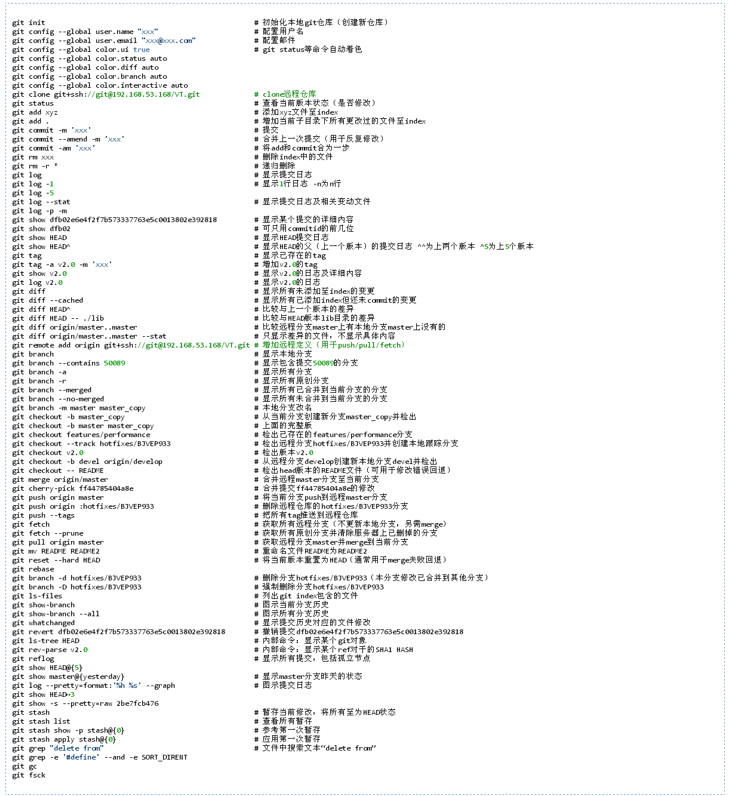

# git 指令

Git 是什麼？
一種版本控制的工具

練習工具 
https://learngitbranching.js.org/?locale=zh_TW

GitHub 是什麼？
一個網站。讓你放原始碼 (Source Code) 的空間，如果只需要放公開的程式碼，可以免費使用


```
//設定使用者名稱以及email
git config --global user.name
git config --global user.email
git config --list

//比較常見的使用指令
git status #查看版控狀態
git add . #路徑下所有更改過的檔案加到準備存檔的狀態
git commit -m "Hello, world!" (-m 代表的是message)
git log #查看提交歷史紀錄
git restore abc.txt #回復檔案的狀態
git reset "commit hash" #回復到你要的存檔
git reset --hard 讀取存檔之前的檔案,之後加的都不要留下來

//可用doskey設定快捷鍵
    (尚未使用)

//分支相關
git branch "分支名稱 "#創建分支
git branch -D "分支名稱" #刪除分支
git branch -r  #查看分支

git checkout "分支名稱" #切換分支
git checkout -b "分支名稱" #創造支縣,並切換過去
git checkout - #快速在兩分支重複切換
git merge "分支名稱" (在主線上用merge做合併,去合併分支)
git merge "主線名稱" (分支上合併主線)
:x #(確認合併與結束的指令)

git cherry-pick "commit hash" 
#選取你要添加的hash ,通常是修正有問題的commit,要照順序去pick

git reflog #查看先前更動的動作 (f向上,b向下 搭配git reset --hard 使用)
git stash #暫存目前工作
git stash list #列出暫存目前工作
git stash pop  #調出暫存的工作 (但會把stash list的存檔也消除掉)
git stash save "fix bug ,later back " (暫存目前工作,並加說明)
git stash apply "num" #從git stash list 可選出 (不會把stash list的存檔消除掉)


//github相關
git push --set-upstream origin "分支名稱" #將已存在的分支推送到github
git push -u origin "分支名稱" (同上)

//修復不小心把錯誤的代碼push在github上
git revert  #git log 找出錯誤的commit 並在Vim的畫面輸入(:x!) 
git rebase -i HEAD~數字 #commit 紀錄會很雜 ,所以透過rebase整理,在Vim的畫面 squash 取代pick
git pull origin main #更新github上的分支,與他們的主線同步


//merge conflicts 合併衝突


//-------------------------------------------------------
git remote -v #查詢 origin url  ，確認目前Git遠端伺服器網址
git remote add origin "repo的位置"
git remote set-url "別名" "url"  #更換Git遠端伺服器位網址
git remote add "別名" "url"
git pull = git fetch(查看) + git merge (同步分支)

git push --set-upstream origin "分支"
git commit -am "message" (同時 add 以及commit)
git clone --branch <branchname> <remote-repo-url> 拉取特定分支
```


[參考網站](https://www.mit.edu/~amidi/teaching/data-science-tools/study-guide/engineering-productivity-tips/#working-with-bash)


設定auth
```
git help -a | grep credential

＃取得
git config --show-origin --get credential.helper

＃恢復
git  config --global  credential.helper  osxkeychain

```


<br>

# Git flow 


Master 分支:

主要是用來放穩定、隨時可上線的版本。這個分支的來源只能從別的分支合併過來，開發者不會直接 Commit 到這個分支。因為是穩定版本，所以通常也會在這個分支上的 Commit 上打上版本號標籤。

Develop 分支:

這個分支主要是所有開發的基礎分支，當要新增功能的時候，所有的 Feature 分支都是從這個分支切出去的。而 Feature 分支的功能完成後，也都會合併回來這個分支。

Hotfix 分支:

當線上產品發生緊急問題的時候，會從 Master 分支開一個 Hotfix 分支出來進行修復，Hotfix 分支修復完成之後，會合併回 Master 分支，也同時會合併一份到 Develop 分支。

為什麼要合併回 Develop 分支？如果不這麼做，等到時候 Develop 分支完成並且合併回 Master 分支的時候，那個問題就又再次出現了。

那為什麼一開始不從 Develop 分支切出來修？因為 Develop 分支的功能可能尚在開發中，這時候硬是要從這裡切出去修再合併回 Master 分支，只會造成更大的災難。

Release 分支:

當認為 Develop 分支夠成熟了，就可以把 Develop 分支合併到 Release 分支，在這邊進行算是上線前的最後測試。測試完成後，Release 分支將會同時合併到 Master 以及 Develop 這兩個分支上。Master 分支是上線版本，而合併回 Develop 分支的目的，是因為可能在 Release 分支上還會測到並修正一些問題，所以需要跟 Develop 分支同步，免得之後的版本又再度出現同樣的問題。

Feature 分支:

當要開始新增功能的時候，就是使用 Feature 分支的時候了。Feature 分支都是從 Develop 分支來的，完成之後會再併回 Develop 分支。

[參考網站](https://gitbook.tw/chapters/gitflow/why-need-git-flow)


https://chenjinny.medium.com/git-setting-on-macos-learning-notes-21c98a8aa700
